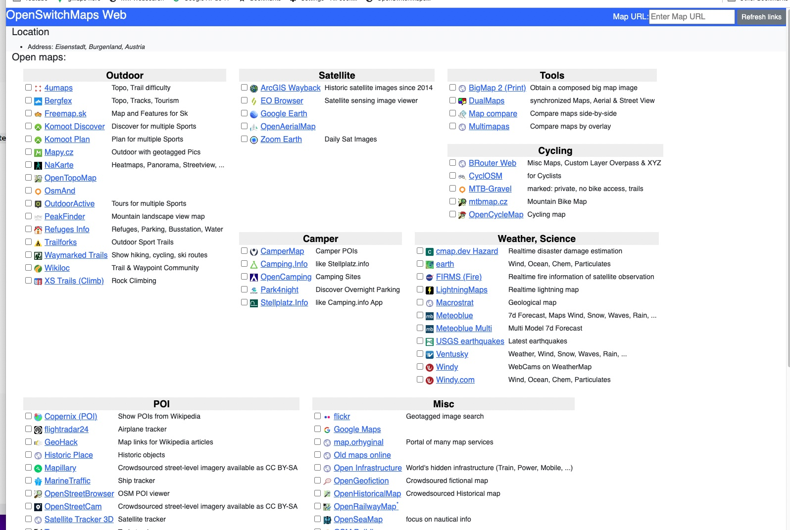

# OpenSwitchMapsWeb
Web version of [OpenSwitchMaps](https://github.com/limex/OpenSwitchMaps-v3). Both are forks of repos from [tankaru](https://github.com/tankaru).

# Why not browser extension?
I forked the version from tankaru, because I wanted to use my maps on my iphone and ipad.  
There are ways to migrate a Chrome Extension to Safari, but having them permanent on the iphone/ipad needs an Apple Developer Account for €100 / year.  
Currently I am not willing to pay this and use the OpenSwitchMapsWeb instead.

## How to use
1. Bookmark this bookmarklet
```javascript:(function(){ window.location.href="https://limex.github.io/osmw/index.html#"+location.href;})();```
1. Open Map service
1. Open saved Bookmarklet
1. You will move to a web page. And you will get links to map services


  

---
---
  

  
# OpenTrackTriviaWeb
Web version of [TrackTrivia](https://github.com/limex/TrackTrivia).

# Why not browser extension?
There are ways to migrate a Chrome Extension to Safari, but having them permanent on the iphone/ipad needs an Apple Developer Account for €100 / year.  
Currently I am not willing to pay this and use the OpenSwitchMapsWeb instead.

## How to use
1. Bookmark this bookmarklet
```javascript:(function(){ window.location.href="https://limex.github.io/ttw/index.html#"+location.href;})();```
1. Open Map service
1. Open saved Bookmarklet
1. You will move to a web page. And you will get links to map services


